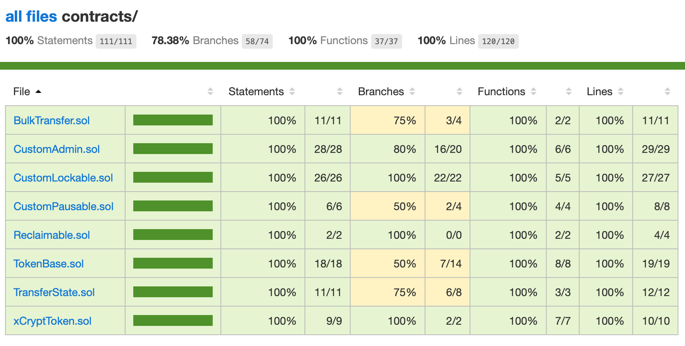

# xCrypt Token

**About Us**

XCRYPT is the first crypto ecosystem with an high added value with the heart in its exchange: Hybrid, ready for STO and for a marketplace made for the ERC721. We created this end to end system which includes a Debit Card and a Social Media Trading system which is an advanced investment solution, which enables trading on one account managed by a skillfull and experienced trader using his own funds and joint funds invested by other traders in his SMT account. This ecosystem is made to be at the same level as the world’s big players, and even surpass them, for we are already suitable in this field’s future.

This repository contains ERC20 token contract code of xCrypt.club.

## How to Install?

**Install Truffle Tools**

https://truffleframework.com

**Install Solidoc**

```node
npm install solidoc -g
```

**Install Solidity Flattener**

```node
npm install sol-flattener -g
```

**Clone the Repository**

```git
git clone https://github.com/xcryptclub/xCryptToken
```

**Install Packages**

```node
npm install
```

## Running Tests

**Run Tests**

```shell
truffle test
```

## Create Documentation

```shell
solidoc
```

## Flatten Contract

```shell
sol-flattener
```

## Other

```shell
npm run solhint
npm run solium
```

[Read Documentation](docs/xCryptToken.md)

### Code Coverage



**Create Coverage Report**

```shell
npm run coverage
```

## xCrypt ECOSYSTEM

What makes our trading platform stand out?

- Fully compliant trading operations
- Trading + Social Trading Platform
- Withdraw FIAT from cryptocurrencies | Store FIAT and cryptocurrencies - Custom built Bot Trading | Airdrop Ranking System
- Erc 20 | Erc 721 | Memberships
- ZERO fees | Securities token
- Dependable digital wallets | 100% encrypted platform
- Multi Language Platform | Fast deposits and withdrawals
- Exchange FIAT and Cryptocurrencies
- Make payments with FIAT and cryptocurrencies
- Providing tutorials and webinars from expert traders
- User friendly website interface and mobile app

## Tokenomics

| Type               | Description     |
| ------------------ | --------------- |
| Token Type         | ERC20 Token     |
| Name               | xCrypt Token    |
| Ticker             | XCT             |
| Decimals           | 18              |
| Maximum Supply     | 200 million XCT |
| Circulating Supply | 200 Million XCT |
| Contract Address   | TBA             |

### Links

- [Website](https://www.xcrypt.club)
- [Facebook](https://www.facebook.com/xcryptclub/)
- [Twitter](https://twitter.com/xcryptclub)
- [Instagram](https://www.instagram.com/xcryptclub/)
- [Youtube](https://www.youtube.com/channel/UCSTVlIYw7fj9PrVu9FYKKVQ)
- [Github](https://github.com/xcryptclub)
- [Bitcointalk](https://bitcointalk.org/index.php?topic=4993175.0)
- [Medium](https://medium.com/@xcryptclub)
- [Telegram](https://t.me/xcryptclub)
